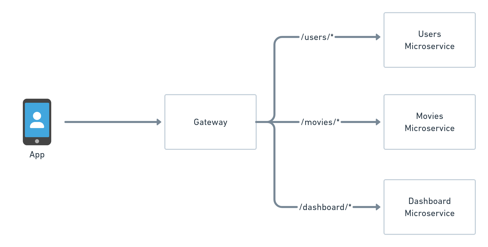

# Utilizando o Istio como gateway

Na [seção anterior](3-Servicos.md) instalamos e inicializamos três microsserviços que compõe a nossa aplicação de exemplo: *users*, *movies* e *dashboard*.

Porém constatamos que tais serviços não são acessíveis de fora do cluster, pois foram configurados para assumir o tipo `ClusterIP`.

Normalmente, esta é a configuração desejada em clusters do mundo real: os vários microsserviços 
são configurados para atender requests originados diretamente de dentro do cluster apenas.

Para expor os serviços externamente, para assim serem capazes de atender requests vindos da Internet (ou no nosso caso, vindos do nosso
localhost, através do comando `curl`), iremos aplicar a funcionalidade de gateway do Istio.

## Conteúdo desta seção

...

## <a name="para_que_serve"></a> Para que serve um gateway?

Um *gateway* (do inglês "porta de entrada", ou "portal") é um serviço rodando em nosso cluster que é exposto externamente. 

Portanto, o gateway possui um IP acessível de fora do cluster.

O propósito do gateway é concentrar em si todos os requests para a aplicação, e por sua vez destinar tais requests para
os devidos microsserviços rodando internamente no cluster:



## <a name="instalacao"></a> Instalação do gateway

Este repositório contém [este diretório](https://github.com/ribaptista/istio-exemplos/tree/main/code/4-Gateway) com toda a configuração
necessária para criar um gateway no Istio.

Entre no diretório `code/4-Gateway/` em um terminal e rode:

```console
ricardo@ricardo-A60-MUV:~/istio-exemplos/code/4-Gateway$ kubectl apply -k .
gateway.networking.istio.io/my-sample-app created
virtualservice.networking.istio.io/dashboard created
virtualservice.networking.istio.io/movies created
virtualservice.networking.istio.io/users created
```

A saída do comando acima nos mostra que foram criados quatro recursos em nosso cluster: um *gateway* e quatro *virtual services*.

Antes de explorar o conteúdo dos arquivos de configuração que acabamos de aplicar, vamos testar nosso gateway.

## <a name="testando"></a> Testando o gateway

O Istio expõe o gateway que criamos através de um serviço chamado *ingress gateway*. 

O ingress gateway foi criado automaticamente quando instalamos o *operator* na seção [2: Instalando o Istio em um cluster de Kubernetes](2-Instalacao.md). 

Obtenha o status do *ingress gateway* com o seguinte comando:

```console
ricardo@ricardo-A60-MUV:~/istio-exemplos/code/4-Gateway$ kubectl get svc istio-ingressgateway -n istio-system
NAME                   TYPE           CLUSTER-IP       EXTERNAL-IP   PORT(S)                                      AGE
istio-ingressgateway   LoadBalancer   10.100.236.210   <pending>     15021:32010/TCP,80:31197/TCP,443:32143/TCP   65m
```

Perceba que o ingress gateway ainda não possui um ip externo atribuído a ele (pelo valor `<pending>` na coluna `EXTERNAL-IP`).

Mas repare que, diferentemente dos outros outros serviços que exploramos na seção anterior, o ingress gateway possui o tipo `LoadBalancer` ao invés de `ClusterIP`.

Isto significa que este serviço é capaz receber um IP externo e assim atender a requests vindos de fora do cluster.

No nosso cenário, onde utilizamos o minikube como implementação do cluster de kubernetes, podemos atribuir um IP externo ao ingress gateway da seguinte forma:

No terminal, digite:
```
ricardo@ricardo-A60-MUV:~/istio-exemplos/code/4-Gateway$ minikube tunnel -p istio-exemplos
[sudo] password for ricardo: 
```

O comando pedirá a sua senha para obter privilégios de *super user*.

Mantenha o comando rodando neste terminal, e em um terminal paralelo, repita o mesmo comando de verificação do status do ingress gateway:

```console
ricardo@ricardo-A60-MUV:~/istio-exemplos/code/4-Gateway$ kubectl get svc istio-ingressgateway -n istio-system
NAME                   TYPE           CLUSTER-IP       EXTERNAL-IP      PORT(S)                                      AGE
istio-ingressgateway   LoadBalancer   10.100.236.210   10.100.236.210   15021:32010/TCP,80:31197/TCP,443:32143/TCP   70m
```

Repare que agora o ingress gateway possui um ip externo, `10.100.236.210` (o valor exato do IP pode variar). 


### 💡💡💡 Importante!

É importante entender a diferença entre *ingress gateways*, *gateways* e *virtual services*: 

Um cluster pode conter apenas um único ingress gateway, capaz de atender requests para várias aplicações independentes dentro do cluster
(incluindo aplicações respondendo em diferentes hosts, como `foo.company.io` e `bar.company.io`).

A partir disso podemos ter um *gateway* para cada aplicação. O gateway tratará apenas os requests destinados à aplicação que expõe.
Por exemplo, o gateway `foo` atende apenas a porção de requests que chegam ao ingress gateway destinadas ao host `foo.company.com`.

Por fim, teríamos um *virtual service* para cada microsserviço, ou *service* do kubernetes. 

Um virtual service está normalmente associado a um *gateway*, e, dos requests que chegam ao gateway, atende apenas a parcela que
é destinada ao microsserviço em que atua.


