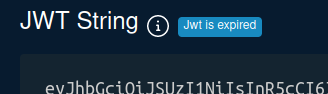

# Autenticação de usuário com JWT

A autenticação de usuários através de *JSON Web Tokens* (ou JWT) tornou-se um padrão para as aplicações atuais por sua simplicidade e flexibilidade.

Nesta seção demonstraremos mais uma funcionalidade do Istio: a camada de autenticação de usuário final utilizando tokens JWT.

## Conteúdo desta seção

- [Breve explicação sobre JWTs](#breve_explicacao)
- [Habilitando a autenticação na aplicação exemplo](#habilitando)
- [Preparando o ambiente para os testes](#preparando)
- [Testando a autenticação](#testando)
    - [Cenário 1: Request anônimo](#cenario_1)
    - [Cenário 2: Enviando um token válido](#cenario_2)
    - [Cenário 3: Token expirado](#cenario_3)
    - [Cenário 4: Token falsificado](#cenario_4) 
- [Debugando JWTs](#debugando)
- [Criando JWTs](#criando)
- [Desafio](#desafio)
- [Próximos passos](#proximos_passos)

## <a name="breve_explicacao"></a> Breve explicação sobre JWTs

JWTs são tokens emitidos por um servidor de autenticação imediatamente após o login de um usuário.

O token emitido é então enviado pelo frontend em todas as requisições para o backend da aplicação final. 

Apenas requisições contendo tokens legítimos e dentro do prazo de expiração são consideradas pela aplicação final. 

Requisições desprovidas do token ou contendo tokens inválidos são imediatamente recusadas com o código HTTP `401` (Unauthorized) ou `403` (Forbidden).

Este repositório contém alguns exemplos de JWTs [neste diretório](https://github.com/ribaptista/istio-exemplos/tree/main/code/6-JWT/samples) 
que utilizaremos adiante para testar a camada de autenticação do Istio.

JWTs sempre carregam consigo a assinatura criptográfica do servidor de autenticação que os emitiu, tornando virtualmente impossível a sua falsificação 
(desde que tanto o servidor de autenticação quanto a aplicação final tenham sido configurados corretamente). 

A assinatura de um JWT é determinada pela *private key* utilizada pelo servidor de autenticação. 

A aplicação final verifica a autenticidade de um JWT através de uma *public key* disponibilizada publicamente pelo servidor de aplicação em uma URL conhecida.

Assim, apenas a *private key* é capaz de assinar um JWT, enquanto que a *public key* é apenas capaz de verificar a assinatura de um JWT.

## <a name="habilitando"></a> Habilitando a autenticação na aplicação exemplo

Partiremos do estado em que se encontra nossa aplicação na [seção anterior](5-TLS.md) para ativar a autenticação por JWT no microsserviço *users*.

Em um terminal, acesse o diretório `code/6-JWT` e digite o comando abaixo:

```console
ricardo@ricardo-A60-MUV:~/istio-exemplos/code/6-JWT$ kubectl apply -f auth-users.yaml 
requestauthentication.security.istio.io/jwt-auth created
authorizationpolicy.security.istio.io/jwt-auth created
```

Pronto! Antes de analisarmos o conteúdo do arquivo `auth-users.yaml` aplicado no comando acima, 
vamos primeiro testar a autenticação ativada no microsserviço *users*.

## <a name="preparando"></a> Preparando o ambiente para os testes

Assim como nas seções anteriores, é necessário iniciar o comando de túnel do minikube para podemos acessar a aplicação.

Em um terminal, digite:

```console
ricardo@ricardo-A60-MUV:~$ minikube tunnel -p istio-exemplos
```

Mantenha este comando rodando durante toda a duração dos testes.

## <a name="testando"></a> Testando a autenticação

Por simplicidade, para os testes de autenticação a seguir utilizaremos alguns JWTs estáticos presentes 
[neste diretório](https://github.com/ribaptista/istio-exemplos/tree/main/code/6-JWT/samples) 
do repositório.

Entretanto, ao final desta seção você aprenderá como debugar o conteúdo de JWTs e como criar seus próprios JWTs! 

### <a name="cenario_1"></a> Cenário 1: Request anônimo

Neste primeiro cenário, enviaremos à aplicação um request anônimo, ou seja, desprovido de um token JWT. 

Este request é idêntico ao utilizado na seção anterior para testar a camada de TLS da aplicação.

```console
ricardo@ricardo-A60-MUV:~$ curl -k --resolve "my-sample-app.io:443:10.100.236.210" -w "\n%{http_code}\n" https://my-sample-app.io/users/profile
RBAC: access denied
403
```

Se você recebeu o código de erro `403` (Forbidden) como a saída exibida acima, o Istio já está protegendo o microsserviço *users* contra requests não-autenticados!

### <a name="cenario_2"></a> Cenário 2: Enviando um token válido

Agora testaremos um cenário de sucesso. 

Envie a mesma requisiçao anterior, porém acrescentando [este token válido](https://raw.githubusercontent.com/ribaptista/istio-exemplos/main/code/6-JWT/samples/valid.jwt)
no header `Authorization` da requisição:

```console
ricardo@ricardo-A60-MUV:~$ curl -H "Authorization: Bearer $(curl https://raw.githubusercontent.com/ribaptista/istio-exemplos/main/code/6-JWT/samples/valid.jwt -s)" -k --resolve "my-sample-app.io:443:10.100.236.210" -w "\n%{http_code}\n" https://my-sample-app.io/users/profile
{"id":101,"name":"John Doe","birthday":"1985-07-15","email":"johndoe@email.com"}
200
```

O código `200` (OK) e o JSON com os dados de profile do usuário recebidos na saída acima indicam que o Istio 
reconheceu a legitimidade do token e assim permitiu o acesso ao microsserviço *users*.  

### <a name="cenario_3"></a> Cenário 3: Token expirado

Por motivos de segurança, todo token emitido por servidores de autenticação incluem um metadado chamado `exp`, que representa
o timestamp (data e hora) de expiração do token.

Aplicações finais não devem aceitar requests portando tokens expirados (tokens cuja propriedade `exp` sejam anteriores à data e hora do request). 

No exemplo abaixo a requisição carrega [um token expirado](https://raw.githubusercontent.com/ribaptista/istio-exemplos/main/code/6-JWT/samples/expired.jwt):

```console
ricardo@ricardo-A60-MUV:~$ curl -H "Authorization: Bearer $(curl https://raw.githubusercontent.com/ribaptista/istio-exemplos/main/code/6-JWT/samples/expired.jwt -s)" -k --resolve "my-sample-app.io:443:10.100.236.210" -w "\n%{http_code}\n" https://my-sample-app.io/users/profile
Jwt is expired
401
```

A mensagem `Jwt is expired` retornada pelo Istio indica que nossa aplicação está protegida contra tokens expirados.

### <a name="cenario_4"></a> Cenário 4: Token falsificado

Retomaremos aqui os conceitos de *private* e *public keys* introduzidos no início desta seção.

Os tokens utilizados nos cenários anteriores (token válido e token expirado) foram assinados com [esta private key](https://github.com/ribaptista/istio-exemplos/blob/main/code/6-JWT/keys/jwt.key), 
incluída neste repositório por motivos puramente didáticos.

No arquivo [auth-users.yaml](https://github.com/ribaptista/istio-exemplos/blob/main/code/6-JWT/auth-users.yaml), aplicado no início
desta seção para habilitar a autenticação no microsserviço *users*, configuramos o Istio a validar a autenticidade da assinatura de
tokens JWT na linha abaixo:

```yaml
  jwtRules:
    - issuer: "my-auth-server.io"
      jwksUri: https://raw.githubusercontent.com/ribaptista/istio-exemplos/main/code/6-JWT/jwks/jwks.json
```

O campo `jwtkUri` é normalmente uma URL exposta públicamente na Internet pelo serviço de autenticação, e contém a *public key* capaz de
verificar a assinatura dos JWTs emitidos pelo serviço de autenticação.

No exemplo abaixo, vamos testar o envio [deste token](https://raw.githubusercontent.com/ribaptista/istio-exemplos/main/code/6-JWT/samples/fake.jwt) que, embora bem-formado, foi emitido por um serviço de autenticação estranho à aplicação,
e portanto foi assinado por uma *private key* diferente da esperada pela *public key* configurada no Istio:

```console
ricardo@ricardo-A60-MUV:~$ curl -H "Authorization: Bearer $(curl https://raw.githubusercontent.com/ribaptista/istio-exemplos/main/code/6-JWT/samples/fake.jwt -s)" -k --resolve "my-sample-app.io:443:10.100.236.210" -w "\n%{http_code}\n" https://my-sample-app.io/users/profile
Jwt verification fails
401
```

Assim, constatamos pelo retorno do comando acima que o Istio bloqueia qualquer tentativa de acesso que não inclua um
token JWT emitido e assinado pelo servidor de autenticação de confiança da aplicação.

## <a name="debugando"></a> Debugando JWTs

Os JWTs estáticos dos experimentos acima foram criados no site [token.dev](https://token.dev/).

Uma vez no token.dev, vamos examinar o conteúdo nosso [exemplo](https://github.com/ribaptista/istio-exemplos/blob/main/code/6-JWT/samples/expired.jwt) de token expirado:

1. No campo **Algorithm**, selecione `RS256`.
2. No campo **JWT String**, cole o conteúdo do arquivo [expired.jwt](https://raw.githubusercontent.com/ribaptista/istio-exemplos/main/code/6-JWT/samples/expired.jwt)
3. No campo **Public key** cole o conteúdo do arquivo [jwt.pub](https://raw.githubusercontent.com/ribaptista/istio-exemplos/main/code/6-JWT/keys/jwt.pub)
4. No campo **Private key** cole o conteúdo do arquivo [jwt.key](https://raw.githubusercontent.com/ribaptista/istio-exemplos/main/code/6-JWT/keys/jwt.key)

O campo **Payload** exibirá o conteúdo do JWT em formato JSON:

```json
{
  "sub": "1234567890",
  "name": "John Doe",
  "iat": 1516239022,
  "iss": "my-auth-server.io",
  "exp": 1516249022
}
```

O site exibe o seguinte alerta sobre a validade do token:



Ao passar o cursor sobre o campo `exp` o site exibirá um tooltip com o alerta de expiração do token.

## <a name="criando"></a> Criando JWTs

Ainda com os dados do token carregados no token.dev, é possível editar o conteúdo do campo **Payload** (por exemplo, alterando o conteúdo do campo `name`).

O conteúdo do campo **JWT String** será automaticamente alterado para refletir as alterações feitas na representação JSON do JWT, incluindo
a assinatura criptográfica determinada pela chave presente no campo **Private Key**.

## <a name="desafio"></a> Desafio

Utilize o site token.dev gerar um token com as seguintes características:

* Deve ser emitido para o usuário de nome "John Joe"
* Deve expirar em 1 hora
* Deve ser assinado pela [mesma *private key*](https://raw.githubusercontent.com/ribaptista/istio-exemplos/main/code/6-JWT/keys/jwt.key) utilizada durante toda esta seção.

Envie uma requisição com este token para a nossa aplicação na URL `https://my-sample-app.io/users/profile`:

```console
ricardo@ricardo-A60-MUV:~$ curl -H "Authorization: Bearer [Insira o conteúdo do seu token aqui]" -k --resolve "my-sample-app.io:443:10.100.236.210" -w "\n%{http_code}\n" https://my-sample-app.io/users/profile
{"id":101,"name":"John Doe","birthday":"1985-07-15","email":"johndoe@email.com"}
200
```

Para considerar o desafio como concluído, o retorno da requisição deve ser bem-sucedido como a saída acima.

## <a name="proximos_passos"></a> Próximos passos

Muito bem! Nesta seção entendemos como aumentar a segurança de uma aplicação implementado diretamente no Istio a autenticação de usuário final baseada em JWT.
Na próxima seção nos aprofundaremos na segurança de nossa aplicação ativando a autenticação bidirecional entre microsserviços.
